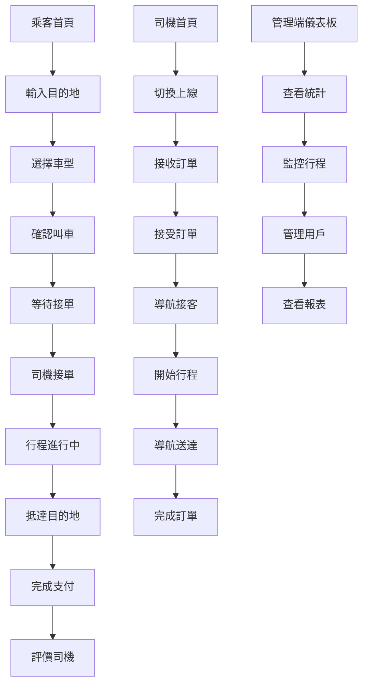

## 1. 產品概述
打造一個Uber風格的乘車服務平台，提供乘客叫車、司機接單、以及管理端監控的完整解決方案。
- 乘客可即時叫車、追蹤司機位置、完成支付
- 司機可接收訂單、導航至目的地、管理收入
- 管理端可監控所有行程、管理用戶、分析數據

## 2. 核心功能

### 2.1 用戶角色
| 角色 | 註冊方式 | 核心權限 |
|------|----------|----------|
| 乘客 | 手機號碼/Email註冊 | 叫車、追蹤行程、支付、評價 |
| 司機 | 手機號碼/Email註冊+審核 | 接單、導航、完成行程、查看收入 |
| 管理員 | 後台創建 | 管理用戶、監控行程、數據分析 |

### 2.2 功能模組
我們的乘車服務平台包含以下主要頁面：
1. **乘客首頁**：地圖顯示、起訖點輸入、車型選擇、即時叫車
2. **乘客行程頁面**：行程列表、行程詳情、支付、評價
3. **司機首頁**：接單開關、地圖顯示、導航、收入統計
4. **司機行程頁面**：當前訂單、歷史訂單、收入明細
5. **管理端儀表板**：總覽統計、用戶管理、行程監控

### 2.3 頁面詳情
| 頁面名稱 | 模組名稱 | 功能描述 |
|----------|----------|----------|
| 乘客首頁 | 地圖顯示 | 顯示當前位置、附近車輛、可拖動地圖 |
| 乘客首頁 | 起訖點輸入 | 輸入上車地點、目的地、預估費用 |
| 乘客首頁 | 車型選擇 | 選擇車型（經濟/舒適/商務）、查看價格 |
| 乘客首頁 | 即時叫車 | 確認叫車、等待司機接單、顯示預估到達時間 |
| 乘客行程頁面 | 行程列表 | 顯示歷史行程、進行中行程 |
| 乘客行程頁面 | 行程詳情 | 顯示司機資訊、車輛資訊、路線追蹤 |
| 乘客行程頁面 | 支付功能 | 選擇支付方式、完成付款、索取發票 |
| 乘客行程頁面 | 評價功能 | 給司機評分、撰寫評論 |
| 司機首頁 | 接單開關 | 切換上線/下線狀態、接收訂單通知 |
| 司機首頁 | 地圖導航 | 顯示乘客位置、導航至目的地 |
| 司機首頁 | 收入統計 | 顯示今日收入、本週收入、接單數量 |
| 司機行程頁面 | 當前訂單 | 顯示進行中訂單、乘客資訊、導航按鈕 |
| 司機行程頁面 | 歷史訂單 | 顯示已完成訂單、收入明細 |
| 管理端儀表板 | 總覽統計 | 顯示總訂單數、活躍用戶數、收入統計 |
| 管理端儀表板 | 用戶管理 | 搜尋用戶、查看用戶詳情、封禁用戶 |
| 管理端儀表板 | 行程監控 | 即時查看所有進行中行程、處理異常 |

## 3. 核心流程

### 乘客叫車流程
1. 乘客開啟應用程式，系統自動定位當前位置
2. 輸入目的地，系統計算預估費用和行車時間
3. 選擇車型（經濟/舒適/商務）
4. 確認叫車，系統搜尋附近司機
5. 司機接單後，顯示司機資訊和預估到達時間
6. 司機抵達後開始行程，地圖即時顯示行駛路線
7. 抵達目的地，系統計算實際費用
8. 乘客完成支付並可給予評價

### 司機接單流程
1. 司機開啟應用程式，切換為上線狀態
2. 系統根據司機位置推送附近訂單
3. 司機可選擇接受或拒絕訂單
4. 接受訂單後，導航至乘客上車地點
5. 乘客上車後，開始計費並導航至目的地
6. 抵達目的地後，結束行程並計算費用
7. 等待乘客支付，完成訂單

### 管理端監控流程
1. 管理員登入後台系統
2. 查看即時統計數據（總訂單、活躍用戶等）
3. 監控進行中的行程，處理異常情況
4. 管理用戶帳號，處理申訴和問題
5. 查看收入報表和營運分析

## 4. 用戶介面設計

### 4.1 設計風格
- **主色調**：深藍色（#1a1a1a）和白色為主，輔以綠色（#4CAF50）表示成功狀態
- **按鈕風格**：圓角矩形設計，主要按鈕使用漸層效果
- **字體**：系統預設字體，標題18-24px，內文14-16px
- **佈局風格**：地圖全螢幕顯示，底部浮動操作面板
- **圖標風格**：使用簡潔的線條圖標，符合現代設計趨勢

### 4.2 頁面設計概述
| 頁面名稱 | 模組名稱 | UI元素 |
|----------|----------|--------|
| 乘客首頁 | 地圖顯示 | 全螢幕Google地圖，底部25%區域為操作面板，深藍色背景 |
| 乘客首頁 | 起訖點輸入 | 圓角輸入框，白色背景，綠色確認按鈕，顯示預估價格 |
| 乘客首頁 | 車型選擇 | 橫向滑動卡片，顯示車型圖片、價格、預估時間 |
| 司機首頁 | 接單開關 | 大型圓形切換開關，綠色表示上線，灰色表示下線 |
| 司機首頁 | 收入統計 | 卡片式設計，顯示今日收入數字，使用綠色強調 |
| 管理端儀表板 | 統計卡片 | 網格佈局，每個統計項目使用獨立卡片，包含圖標和數字 |

### 4.3 響應式設計
- **桌面優先**：主要設計以桌面版為基準，確保功能完整性
- **行動適配**：支援手機和平板裝置，觸控優化的按鈕大小
- **觸控互動**：按鈕最小44px觸控區域，支援滑動和手勢操作