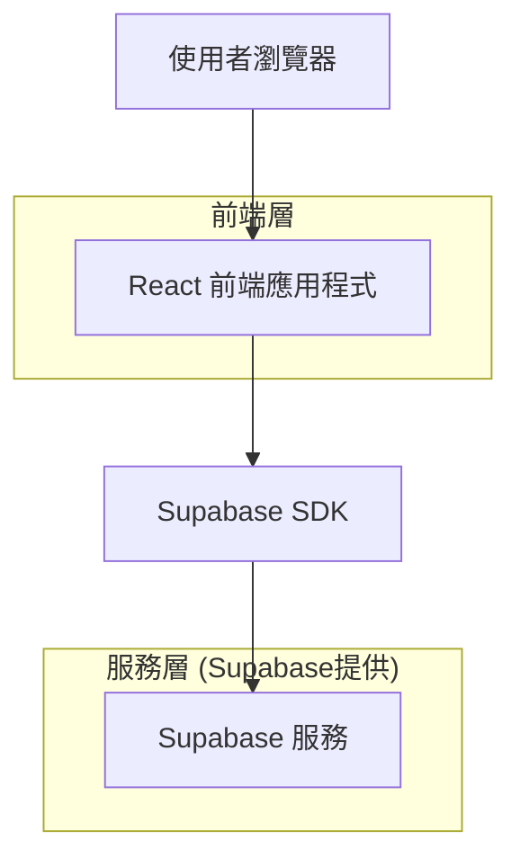

## 1. 架構設計



## 2. 技術說明

- **前端**: React@18 + tailwindcss@3 + vite
- **初始化工具**: vite-init
- **後端**: Supabase (BaaS)
- **地圖服務**: Google Maps API
- **即時通訊**: Supabase Realtime

## 3. 路由定義

| 路由 | 用途 |
|------|------|
| / | 乘客首頁，地圖和叫車功能 |
| /trips | 乘客行程頁面，歷史訂單列表 |
| /driver | 司機首頁，接單和導航功能 |
| /driver/trips | 司機行程頁面，訂單管理 |
| /admin | 管理端儀表板，系統監控 |
| /login | 登入頁面，支援乘客/司機/管理員 |
| /register | 註冊頁面，選擇用戶類型 |

## 4. API 定義

### 4.1 核心 API

**用戶認證相關**
```
POST /auth/v1/token
```

請求:
| 參數名稱 | 參數類型 | 必填 | 描述 |
|----------|----------|------|------|
| email | string | true | 用戶電子郵件 |
| password | string | true | 用戶密碼 |
| type | string | true | 登入類型 (乘客/司機/管理員) |

**行程相關**
```
POST /rest/v1/trips
GET /rest/v1/trips
PUT /rest/v1/trips
```

創建行程請求:
| 參數名稱 | 參數類型 | 必填 | 描述 |
|----------|----------|------|------|
| passenger_id | uuid | true | 乘客ID |
| pickup_location | jsonb | true | 上車地點經緯度 |
| dropoff_location | jsonb | true | 目的地經緯度 |
| car_type | string | true | 車型選擇 |
| estimated_price | decimal | true | 預估價格 |

**即時位置更新**
```
POST /realtime/v1/positions
```

## 5. 資料模型

### 5.1 資料模型定義


### 5.2 資料定義語言

**用戶表 (users)**
```sql
-- 創建表
CREATE TABLE users (
    id UUID PRIMARY KEY DEFAULT gen_random_uuid(),
    email VARCHAR(255) UNIQUE NOT NULL,
    phone VARCHAR(20) UNIQUE NOT NULL,
    password_hash VARCHAR(255) NOT NULL,
    user_type VARCHAR(20) NOT NULL CHECK (user_type IN ('passenger', 'driver', 'admin')),
    status VARCHAR(20) DEFAULT 'active',
    created_at TIMESTAMP WITH TIME ZONE DEFAULT NOW(),
    updated_at TIMESTAMP WITH TIME ZONE DEFAULT NOW()
);

-- 創建索引
CREATE INDEX idx_users_email ON users(email);
CREATE INDEX idx_users_phone ON users(phone);
CREATE INDEX idx_users_type ON users(user_type);

-- 設置權限
GRANT SELECT ON users TO anon;
GRANT ALL PRIVILEGES ON users TO authenticated;
```

**司機檔案表 (driver_profiles)**
```sql
-- 創建表
CREATE TABLE driver_profiles (
    id UUID PRIMARY KEY DEFAULT gen_random_uuid(),
    user_id UUID REFERENCES users(id) ON DELETE CASCADE,
    license_number VARCHAR(50) UNIQUE NOT NULL,
    car_model VARCHAR(100) NOT NULL,
    car_plate VARCHAR(20) NOT NULL,
    rating DECIMAL(3,2) DEFAULT 5.00,
    is_online BOOLEAN DEFAULT FALSE,
    current_location JSONB,
    created_at TIMESTAMP WITH TIME ZONE DEFAULT NOW(),
    updated_at TIMESTAMP WITH TIME ZONE DEFAULT NOW()
);

-- 創建索引
CREATE INDEX idx_driver_profiles_user_id ON driver_profiles(user_id);
CREATE INDEX idx_driver_profiles_online ON driver_profiles(is_online);

-- 設置權限
GRANT SELECT ON driver_profiles TO anon;
GRANT ALL PRIVILEGES ON driver_profiles TO authenticated;
```

**行程表 (trips)**
```sql
-- 創建表
CREATE TABLE trips (
    id UUID PRIMARY KEY DEFAULT gen_random_uuid(),
    passenger_id UUID REFERENCES users(id),
    driver_id UUID REFERENCES users(id),
    pickup_location JSONB NOT NULL,
    dropoff_location JSONB NOT NULL,
    pickup_address TEXT NOT NULL,
    dropoff_address TEXT NOT NULL,
    car_type VARCHAR(20) NOT NULL,
    status VARCHAR(20) DEFAULT 'requested' CHECK (status IN ('requested', 'accepted', 'in_progress', 'completed', 'cancelled')),
    estimated_price DECIMAL(10,2) NOT NULL,
    final_price DECIMAL(10,2),
    distance_km DECIMAL(10,2),
    duration_minutes INTEGER,
    created_at TIMESTAMP WITH TIME ZONE DEFAULT NOW(),
    updated_at TIMESTAMP WITH TIME ZONE DEFAULT NOW(),
    completed_at TIMESTAMP WITH TIME ZONE
);

-- 創建索引
CREATE INDEX idx_trips_passenger ON trips(passenger_id);
CREATE INDEX idx_trips_driver ON trips(driver_id);
CREATE INDEX idx_trips_status ON trips(status);
CREATE INDEX idx_trips_created ON trips(created_at DESC);

-- 設置權限
GRANT SELECT ON trips TO anon;
GRANT ALL PRIVILEGES ON trips TO authenticated;

-- 創建 Row Level Security
ALTER TABLE trips ENABLE ROW LEVEL SECURITY;

-- 乘客只能查看自己的行程
CREATE POLICY "乘客查看自己的行程" ON trips
    FOR SELECT USING (
        auth.uid() = passenger_id
    );

-- 司機只能查看自己的行程
CREATE POLICY "司機查看自己的行程" ON trips
    FOR SELECT USING (
        auth.uid() = driver_id
    );

-- 創建行程時的檢查
CREATE POLICY "乘客創建行程" ON trips
    FOR INSERT WITH CHECK (
        auth.uid() = passenger_id AND 
        status = 'requested'
    );

-- 司機更新行程狀態
CREATE POLICY "司機更新行程狀態" ON trips
    FOR UPDATE USING (
        auth.uid() = driver_id
    );
```

**行程狀態表 (trip_status)**
```sql
-- 創建表
CREATE TABLE trip_status (
    id UUID PRIMARY KEY DEFAULT gen_random_uuid(),
    trip_id UUID REFERENCES trips(id) ON DELETE CASCADE,
    status VARCHAR(20) NOT NULL,
    location JSONB,
    notes TEXT,
    created_at TIMESTAMP WITH TIME ZONE DEFAULT NOW()
);

-- 創建索引
CREATE INDEX idx_trip_status_trip ON trip_status(trip_id);
CREATE INDEX idx_trip_status_created ON trip_status(created_at DESC);

-- 設置權限
GRANT SELECT ON trip_status TO anon;
GRANT ALL PRIVILEGES ON trip_status TO authenticated;
```

**支付表 (payments)**
```sql
-- 創建表
CREATE TABLE payments (
    id UUID PRIMARY KEY DEFAULT gen_random_uuid(),
    trip_id UUID REFERENCES trips(id) ON DELETE CASCADE,
    amount DECIMAL(10,2) NOT NULL,
    payment_method VARCHAR(50) NOT NULL,
    transaction_id VARCHAR(100),
    status VARCHAR(20) DEFAULT 'pending' CHECK (status IN ('pending', 'completed', 'failed')),
    created_at TIMESTAMP WITH TIME ZONE DEFAULT NOW(),
    completed_at TIMESTAMP WITH TIME ZONE
);

-- 創建索引
CREATE INDEX idx_payments_trip ON payments(trip_id);
CREATE INDEX idx_payments_status ON payments(status);

-- 設置權限
GRANT SELECT ON payments TO anon;
GRANT ALL PRIVILEGES ON payments TO authenticated;
```

## 6. Supabase 配置說明

### 6.1 即時功能配置
```sql
-- 啟用行程狀態的即時更新
ALTER TABLE trips REPLICA IDENTITY FULL;
ALTER TABLE trip_status REPLICA IDENTITY FULL;

-- 創建觸發器來自動更新行程狀態
CREATE OR REPLACE FUNCTION update_trip_status()
RETURNS TRIGGER AS $$
BEGIN
    INSERT INTO trip_status (trip_id, status, location)
    VALUES (NEW.id, NEW.status, NEW.current_location);
    RETURN NEW;
END;
$$ LANGUAGE plpgsql;

CREATE TRIGGER trip_status_update
    AFTER UPDATE OF status ON trips
    FOR EACH ROW
    EXECUTE FUNCTION update_trip_status();
```

### 6.2 存儲桶配置
```sql
-- 創建用戶頭像存儲桶
INSERT INTO storage.buckets (id, name, public) 
VALUES ('avatars', 'avatars', true);

-- 創建行程相關文件存儲桶
INSERT INTO storage.buckets (id, name, public) 
VALUES ('trip-documents', 'trip-documents', false);

-- 設置存儲桶權限
CREATE POLICY "公開讀取頭像" ON storage.objects
    FOR SELECT USING (bucket_id = 'avatars');

CREATE POLICY "用戶上傳頭像" ON storage.objects
    FOR INSERT WITH CHECK (
        bucket_id = 'avatars' AND
        auth.uid() = (storage.foldername(name))[1]
    );
```